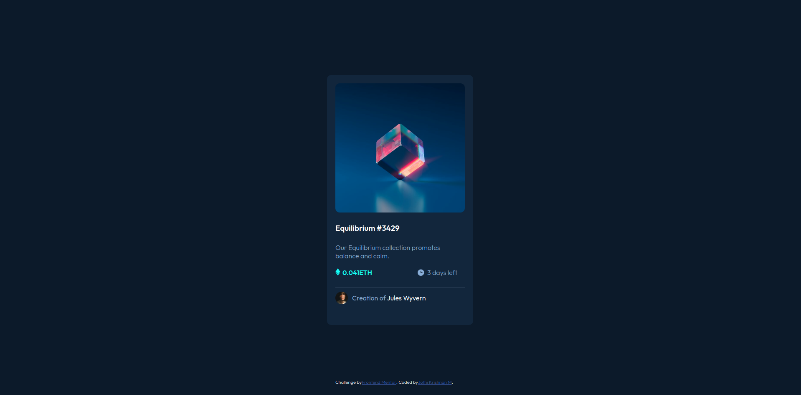

# Frontend Mentor - NFT preview card component solution

This is a solution to the [NFT preview card component challenge on Frontend Mentor](https://www.frontendmentor.io/challenges/nft-preview-card-component-SbdUL_w0U). Frontend Mentor challenges help you improve your coding skills by building realistic projects. 

## Table of contents

- [Overview](#overview)
  - [The challenge](#the-challenge)
  - [Screenshot](#screenshot)
  - [Links](#links)
- [My process](#my-process)
  - [Built with](#built-with)
  - [Useful resources](#useful-resources)
- [Author](#author)

## Overview

### The challenge

Users should be able to:

- View the optimal layout depending on their device's screen size
- See hover states for interactive elements

### Screenshot

### Links

- Solution URL: [My Github Repository](https://github.com/Jothi-krishnan/FEM_newbie02)
- Live Site URL: [Live Website](https://jothi-krishnan.github.io/FEM_newbie02/)

## My process

### Built with

- Semantic HTML5 markup
- CSS custom properties
- Flexbox

### Useful resources

- [W3schools](https://www.w3schools.com/css/default.asp) - This website is just awesome as it is properly structured and explains the concepts cleary with examples.
- [CSS Tricks](https://css-tricks.com/) -  This is an amazing website that is mainly focused on CSS, it offers solution to various problems faced by developers.
- [MDN Web Docs](https://developer.mozilla.org/en-US/) -  This website is created for developers by developers. This is pretty self explanatory.

## Author

- Frontend Mentor - [@Jothi-krishnan](https://www.frontendmentor.io/profile/Jothi-krishnan)

